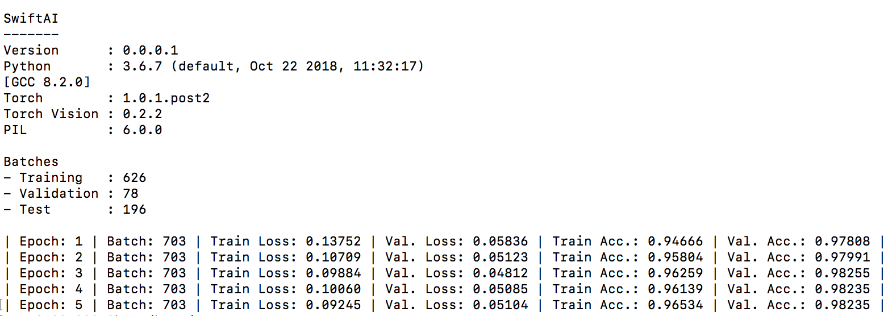
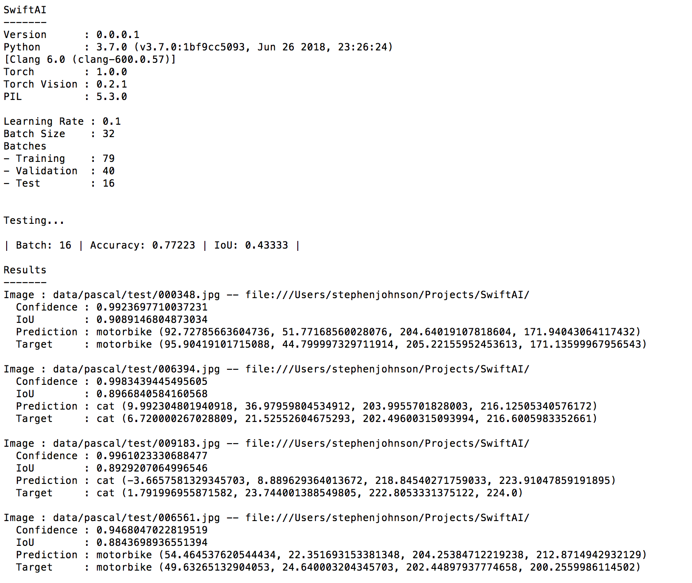

# SwiftAI

SwiftAI is a personal project of mine for learning more about deep learning and neural networks as I work my way through the [Fast.ai](https://www.fast.ai/) courses and learn more about the [Fast.ai](https://github.com/fastai/fastai) library. Since I am writing it in Swift it also allows me to practice my Swift programming skills. In addition to the Swift programming language, SwiftAI uses Python and Pytorch. SwiftAI is shared here for other FastAI students for learning purposes. SwiftAI is a work in progress and is in its earliest stages and will change frequently and is not intended for any purpose other than learning/educational. Note: Many things may be wrong and/or incorrect. Currently, only CPU (not GPU) is supported.

#### Current Version: 0.0.0.1

## Examples
SwiftAI comes with a few examples included. These are:

 - MNIST
 - CIFAR-10
 - Dogs vs. Cats Redux: Kernels Edition
 - Planet: Understanding the Amazon from Space
 - Pascal VOC 2007

## Installation
For those wishing to try out SwiftAI and the examples stated above, the easiest way is to use Docker. There is a Docker directory with associated DockerFile and installation files. 

**Note: The Docker installation assumes the user has a Kaggle account in order to download the Kaggle data for the Dogs Vs. Cats and Planet examples, as well as, to submit results to those Kaggle competitions (see below for submitting to Kaggle). If you do not have a Kaggle account or do not want to try these examples, you will need to comment out or remove those commands in the DockerFile. You may also manually perform these setup steps yourself later inside the Docker container.**

**Another Note: Make sure you have a fast Internet connection before starting the installation as the example data takes a while to download. Optionally, you may modify the DockerFile to comment out examples that you aren't interested in. You may optionally then download them at a later date if so desired.**

To install using Docker perform the following steps after downloading this repository. 

 1. **(See Note Above)** Edit the kaggle.json file to specify your Kaggle username and Kaggle key. If you do not want to use Kaggle or do not have a Kaggle account, then comment out or remove the Kaggle Section of the DockerFile.

 2. From the command line within the Docker directory, execute the following Docker command:
	
		docker build -t swiftai .

 3. After the installation has finished, launch the Docker container using the following command:
 
     	docker run -it swiftai

4. You should be in the /home/SwiftAI directory. Build SwiftAI using the following command:

     	swift build
     
 5. **WARNING: After you are finished with the installation, make sure to delete your username and key from the kaggle.json installation file. Also, do NOT share your image or containers with anyone as it now has your Kaggle credentials. Once you are done with the Docker image and/or containers, make sure to delete accordingly.**
 
## Running the Examples
For all examples, the currently training model's weights will be saved after each epoch in a .pth file. To begin training a model from scratch, delete its associated .pth file before training. These files are saved in the current working directory.

### Training
To begin training a model for one of the examples, execute the following:

    swift run SwiftAI [example] train [num. epochs] [learning rate] [batch size]

Where:

 - **example** is the example to run and is **mnist**, **cifar10**, **dogscats**, **planet** or **pascal**
 - **num. epochs** is the number of epochs to train. Defaults to 1 if not specified.
 - **learning rate** is the learning rate. Defaults to 0.1 if not specified. **num. epochs** must be specified, if this is specified.
 - **batch size** - the batch size. Defaults to 32 if not specified. Both **num. epochs** and **learning rate** must be specified if this is specified.

Below is an example of the output seen during training. This is an example of training using the Dogs Vs. Cats example.

### Testing
 All the examples except MNIST contain a test set. However, for MNIST you may test against the validation set, which you can also do for any of the examples as well.

To predict on the test set for a given example, execute the following:

    swift run SwiftAI [example] test [valid]

Where:

 - **example** is the example to run and is **mnist**, **cifar10**, **dogscats**, **planet** or **pascal**
 - **valid** is the literal word 'valid'. If specified, the test is performed on the validation set, not the test set. For MNIST, this must be specified.

Below is an example of the output seen after testing. This is an example of testing using the Pascal VOC 2007 example. The output is ordered by IoU (Intersection over Untion) in descending order.
  

### Submitting to Kaggle
If you configured your kaggle.json during installation with your Kaggle username and key, you can submit your test results to Kaggle for The Dogs Vs. Cats and the Planet examples. At the end of a test execution for either of these examples, a file that can be submitted to Kaggle is created in addition to the output displayed on screen. 

To submit to the Dogs vs. Cats Redux: Kernels Edition competition, execute the following command:

	kaggle competitions submit -c dogs-vs-cats-redux-kernels-edition -f dogs-vs-cats-redux-kaggle-submission.csv -m "Message"

To submit to the Planet: Understanding the Amazon from Space, execute the following command:

	kaggle competitions submit -c planet-understanding-the-amazon-from-space -f planet-kaggle-submission.csv -m "Message"

